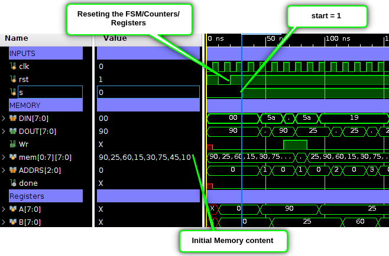
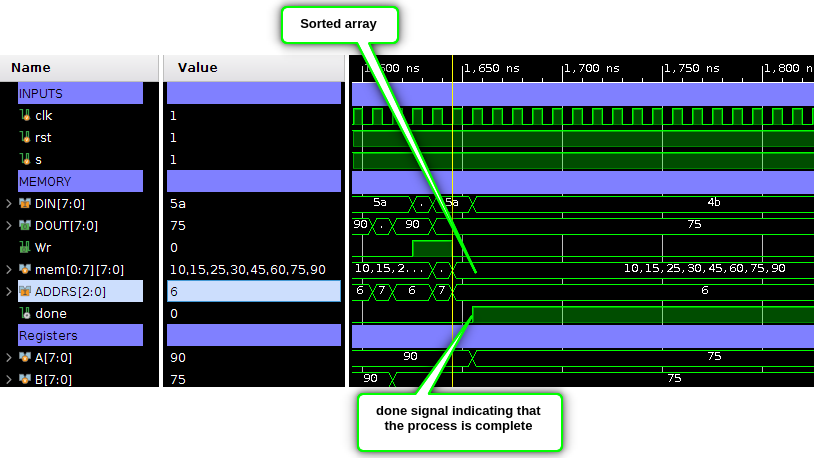

# Sorting Algorithm - Vivado Project

This repository contains the complete **Vivado project** for a hardware implementation of a sorting algorithm.

## RTL Source Files

The RTL (Register Transfer Level) Verilog files are located at the following path within the repository:

👉 [interview.srcs/sources_1/new](https://github.com/Muslim-314/Sort/tree/main/interview.srcs/sources_1/new)

---

## 🧪 Simulation

### Starting Point:

### Ending Point:

---
